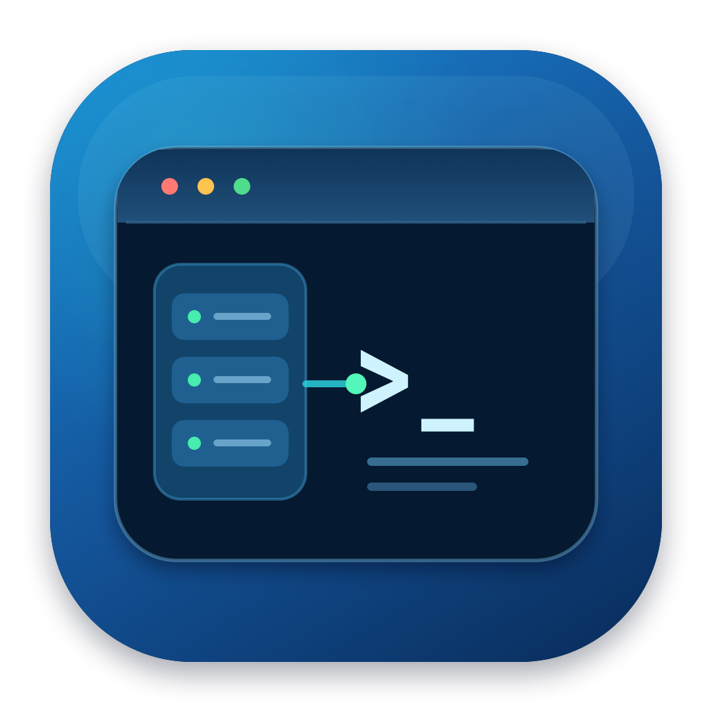
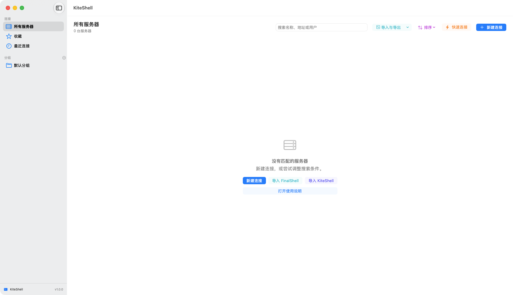

<div align="center">
  
  <h1>KiteShell</h1>
  <p>专为 macOS 打造的快速、原生 SSH 工作台。</p>
  <p>
    <a href="README.md">English</a> ·
    <a href="https://github.com/jinwang-aibai/KiteShell/releases/latest">下载</a> ·
    <a href="CHANGELOG.zh-CN.md">版本记录</a>
  </p>
</div>



KiteShell 将 SSH 终端、远程文件、Linux 实时监控、文件传输、命令脚本和连接管理整合进一个流畅的 macOS 原生应用。界面使用 SwiftUI 与 AppKit，终端使用 SwiftTerm，实际连接由系统 OpenSSH 完成。

## 核心能力

- **macOS 原生体验**：Retina 渲染、系统菜单、快捷键、拖拽、通知、浅色/深色模式和 Apple Silicon 原生架构。
- **真实 SSH 终端**：PTY、UTF-8、ANSI/256 色/真彩色、多标签、搜索、自动重连和终端主题。
- **连接工作台**：收藏、最近连接、侧栏分组、内网/外网与自定义标签、批量分组/标签/收藏/删除、搜索、排序、快速连接、OpenSSH Config 导入、跳板机、代理和端口转发。
- **中英文界面**：可在设置中直接切换中文与英文，无需修改 macOS 系统语言。
- **远程文件**：SFTP 浏览、上传下载、文件夹、拖拽、重命名、移动、权限、删除、内置编辑、外部编辑同步和冲突检测。
- **真实服务器监控**：CPU、内存、Swap、负载、磁盘、网络和进程均来自当前 SSH 会话，不展示模拟数据。
- **命令与脚本**：全局/服务器命令库、变量、执行模式、风险确认和最近执行记录。
- **FinalShell 导入**：支持嵌套 JSON 与兼容密码解析，使用原生 Swift/CommonCrypto，不依赖 Java。
- **本地凭据库**：密码转存 AES-GCM 加密文件，不进入连接 JSON、日志、诊断或普通导出文件。
- **安全更新**：通过 GitHub Releases 检查版本，验证 Ed25519 清单签名和 DMG SHA-256，再由独立更新助手自动安装并支持失败回滚。

## 系统要求

- macOS 14 Sonoma 或更高版本
- Apple Silicon Mac
- 可访问的 SSH 服务器

KiteShell 不兼容 Windows、Linux 桌面或 Intel Mac。

## 安装

1. 从 [GitHub Releases](https://github.com/jinwang-aibai/KiteShell/releases/latest) 下载最新版 DMG。
2. 打开镜像，将 KiteShell 拖入“应用程序”。
3. 启动应用，新建或导入连接。

当前社区构建使用稳定的本机开发签名，尚未使用 Developer ID 和 Apple 公证。要实现公网分发时无缝通过 Gatekeeper，仍需要 Apple Developer 证书。

## 自动更新

KiteShell 最多每 24 小时自动检查一次 GitHub Releases，也可通过菜单“检查更新”或设置页手动检查。

自动安装前会依次验证：

1. 更新清单属于 KiteShell；
2. Ed25519 签名有效；
3. DMG SHA-256 与签名清单一致；
4. 新应用通过严格代码签名校验。

替换失败时会恢复旧版本。技术细节见 [自动更新设计](docs/AUTO_UPDATE.md)。

## 从源码构建

```bash
git clone https://github.com/jinwang-aibai/KiteShell.git
cd KiteShell
swift test
./Scripts/build-app.sh
open .build/KiteShell.app
```

## 测试

```bash
swift test
./Scripts/run-self-tests.sh
```

仓库还包含隔离的密码 SSH 与 SFTP 编辑回传集成测试，不使用生产服务器或真实凭据。

## 隐私与安全

- 默认不上传终端命令、输出、服务器地址或远程文件内容。
- 普通配置导出不包含密码或私钥口令。
- 首次主机密钥由 OpenSSH `accept-new` 记录；已记录密钥变化时拒绝连接。
- DES/MD5 只用于兼容 FinalShell 旧格式，KiteShell 自身使用 AES-GCM 保存凭据。
- 更新私钥不会进入仓库。

提交安全问题前请阅读 [SECURITY.md](SECURITY.md)。

## 开源许可

KiteShell 使用 [Apache License 2.0](LICENSE)。第三方组件仍遵循各自许可，详见[第三方许可](THIRD_PARTY_NOTICES.md)。

## 当前版本

KiteShell 1.1.4（Build 114）进一步统一 Apple 风格：服务卡片层级更清晰、操作移入后显示、混合会话状态直接表达，命令库范围切换与统计区域也保持稳定不重叠。

## 文档

- [架构说明](docs/ARCHITECTURE.md)
- [自动更新](docs/AUTO_UPDATE.md)
- [英文产品需求摘要](docs/PRODUCT_REQUIREMENTS.en.md)
- [中文产品需求完整版](PRODUCT_REQUIREMENTS.md)
- [实现与发布状态](IMPLEMENTATION_STATUS.md)
- [第三方许可](THIRD_PARTY_NOTICES.md)
- [参与贡献](CONTRIBUTING.md)
